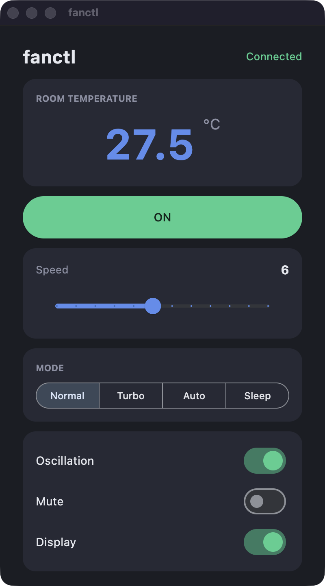

# fanctl

Control **Levoit (VeSync) Classic Tower Fans** — model LTF-F422S — from your
desktop, your browser, or the command line. One Python codebase, a clean
UI-agnostic backend, secure token login, and a modern UI.

> Unofficial, independent project. "Levoit" and "VeSync" are trademarks of their
> respective owners; used here only to describe compatibility.

<p align="center">
  
</p>

---

## Compatibility

⚠️ **This app was developed and tested against a single device: the Levoit
Classic Tower Fan (LTF-F422S series).** It targets that fan's specific VeSync
API calls, modes, and state fields.

Other VeSync/Levoit devices — different fans, air purifiers, humidifiers — are
**not supported out of the box** and will likely need additional work: a new
controller subclass and possibly different state mapping. The architecture is
built for exactly this, though — `FanController` is a clean extension seam. See
[ARCHITECTURE.md → Adding a new device](ARCHITECTURE.md#adding-a-new-device).
Contributions adding more devices are very welcome.

---

## Features

- Power, **speed** (1–12), **mode** (Normal / Turbo / Auto / Sleep)
- **Oscillation**, **mute**, and **display** toggles
- Live **room temperature** (°F → °C handled for you)
- **Login / logout** flow — works with any VeSync account
- **Token-based session** — your password is never stored; log in once, auto-connect after
- **Syncing indicator** — confirms each command actually took effect on the device
- Two frontends over one backend: **Flet** (desktop + web) and **tkinter** (native desktop)
- **Fake backend** for hardware-free development and demos

---

## Quick start

### Run it (developers / from source)

```bash
git clone https://github.com/ardacelep/fanctl
cd fanctl
python3 -m venv venv && source venv/bin/activate
pip install -e .            # add [tk] for the tkinter frontend, [dev] for tests

fanctl                      # Flet desktop app (prompts login on first run)
fanctl --web                # open in the browser
fanctl --fake               # in-memory fake fan — no hardware/internet
fanctl --tk                 # alternative tkinter frontend  (needs: pip install -e ".[tk]")
```

`python3 -m fanctl ...` is equivalent. Flags combine, e.g. `fanctl --fake --web`.

### Install it (end users)

End users shouldn't need to install Python. Ship a native bundle built with Flet
(see [Packaging](#packaging)); the user just downloads and double-clicks. The
in-app login screen handles credentials — no config files.

---

## Usage

**First launch** shows a login screen:

1. **Email / password** — your VeSync app account.
2. **Region** — leave at `EU` if unsure; a wrong choice still works (VeSync
   auto-corrects, see [ARCHITECTURE.md](ARCHITECTURE.md#4-token-auth--cross-region)).
3. **Sign in.** The session token is saved, so you won't be asked again.

| Control | Behavior |
|---|---|
| Power | Toggle on/off (green = on) |
| Speed slider | 1–12; sends the command on release |
| Mode | Normal / Turbo / Auto / Sleep |
| Oscillation / Mute / Display | On-off switches |
| Refresh | Pull fresh state from the cloud |
| Logout | Clears the saved token, returns to login |

After each command the header shows **"Güncelleniyor…"** with a progress bar until
the cloud confirms the new state (e.g. Turbo makes the fan pick its own speed,
which appears within ~1.5 s).

---

## How it works

fanctl separates a pure-async, UI-agnostic **backend** from swappable
**frontends**. The backend handles auth, serialized device I/O, optimistic
updates with a delayed cloud reconcile, and a generation guard so stale reads
never overwrite fresher state. Frontends just *subscribe to state and call
methods*.

See **[ARCHITECTURE.md](ARCHITECTURE.md)** for the full design — the controller
contract, the one-way-rendering rule, the optimistic/reconcile/generation-guard
cycle, the VeSync dual-state-field gotcha, and token + cross-region auth.

```
fanctl/
├── backend/        UI-agnostic device + auth logic
│   ├── state.py        FanState (immutable) + constants
│   ├── controller.py   FanController (ABC) — orchestration policy
│   ├── vesync.py       VeSyncFanController (real device)
│   ├── fake.py         FakeFanController (in-memory)
│   └── paths.py        cross-platform token location
├── ui/             frontends
│   ├── flet_app.py     primary: desktop + web
│   └── tk_app.py       alternative: native tkinter
└── __main__.py     wires a frontend to a backend
tests/              pytest against the fake backend
```

---

## Packaging

Frontend choice maps to a packaging tool.

### Flet (recommended — desktop, web, mobile)

[`flet build`](https://flet.dev/docs/publish) produces native bundles from the
same code (requires the Flutter SDK):

```bash
flet build macos      # .app
flet build windows    # .exe
flet build linux      # binary
flet build apk        # Android
flet build web        # static web bundle
```

Code signing is recommended for distribution (otherwise macOS Gatekeeper /
Windows SmartScreen warn users): Apple Developer (~$99/yr), Windows cert
(~hundreds/yr). For personal/small use, "right-click → Open" bypasses Gatekeeper.

### tkinter

Bundle the `--tk` frontend with [PyInstaller](https://pyinstaller.org) or
[briefcase](https://beeware.org/project/projects/tools/briefcase/). Include
CustomTkinter's assets (PyInstaller hooks / `--add-data`).

---

## Requirements

| Component | Version | Notes |
|---|---|---|
| Python | ≥ 3.10 | tkinter frontend needs Tcl/Tk; Flet does not |
| pyvesync | ≥ 3.4 | VeSync cloud API (async) |
| flet | ≥ 0.85 | primary frontend |
| platformdirs | ≥ 4 | cross-platform token storage |
| customtkinter | ≥ 5 | only for `--tk` (`pip install -e ".[tk]"`) |

> **tkinter / Tcl-Tk:** pyenv often builds Python without tkinter. If `import
> tkinter` fails and you want the `--tk` frontend:
> ```bash
> brew install tcl-tk@8
> CPPFLAGS="-I/opt/homebrew/opt/tcl-tk@8/include" \
> LDFLAGS="-L/opt/homebrew/opt/tcl-tk@8/lib" \
> pyenv install --force 3.11.9
> ```
> Use `tcl-tk@8` (Tk 8.6); Tcl/Tk 9.x is incompatible with this Python.

---

## Troubleshooting

| Symptom | Fix |
|---|---|
| `ModuleNotFoundError: _tkinter` | Rebuild Python with Tk (see above), or just use the default Flet frontend. |
| "E-posta veya şifre hatalı" | Use the same credentials as the VeSync mobile app. |
| "Sunucuya ulaşılamadı" | Check your internet connection. |
| Logged in but no fan | The account must have an LTF-F422S-series fan registered. |
| Switch to another account | **Logout**, then sign in again. |

---

## Security

- **The password is never stored** — used once to authenticate; only the session
  token is written to the per-OS data dir (`platformdirs`). **Logout** deletes it.
- `auth.json` / `config.json` are git-ignored. Never commit credentials.

---

## Contributing

PRs welcome — see [CONTRIBUTING.md](CONTRIBUTING.md). The fake backend lets you
develop and test with no hardware. A new frontend is just *subscribe + render +
call `set_*`*.

## License

[MIT](LICENSE).
